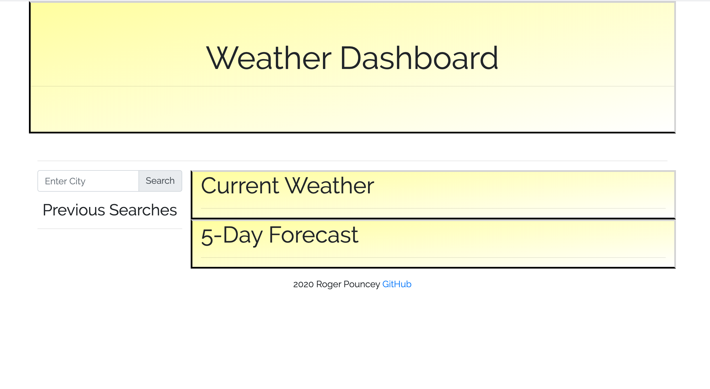
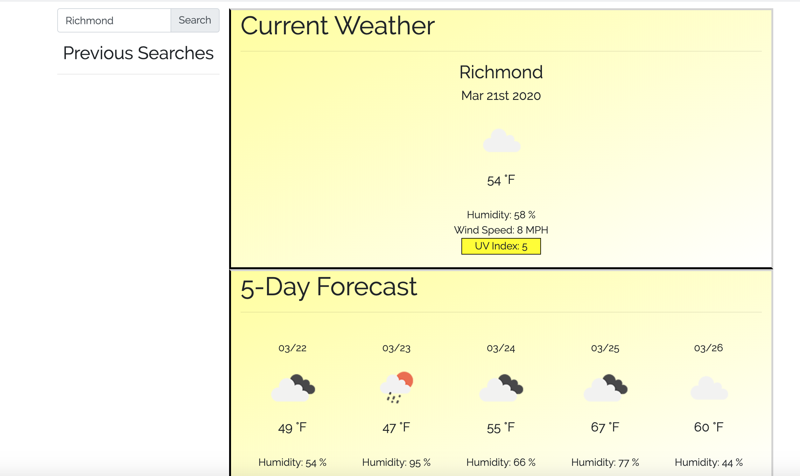
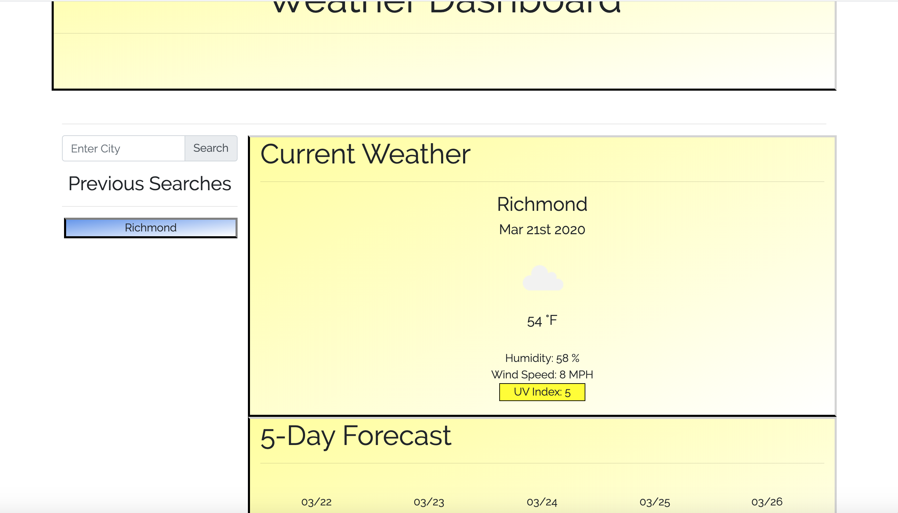

# Weather-Dashboard

**This is a responsive weather app that takes a city name from user input and uses that name to make API calls to retrieve weather information.**

**Upon user submission of a city name, three different calls are made to OpenWeather APIs: one to get current conditions, one to get the current UV index, and one to get the five-day forecast.  Information is appended to the DOM dynamically.  All weather information is pulled from these APIs with the exception of the current date, which is obtained by using MomentJS.**

**Previous searches are saved in localStorage.  Information from localStorage is used to create divs for previous search terms, each of which can be clicked to again search for weather information for that city.  If there are items in localStorage, then upon reloading the page weather information will be populated for the last searched location.**
